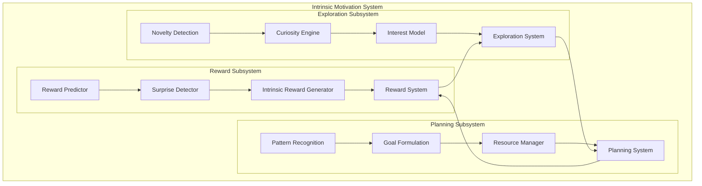

# Intrinsic Motivation System

The Intrinsic Motivation System is a comprehensive framework that enables autonomous exploration, goal emergence, and reward-driven learning in the Godly AI system. It consists of three main subsystems that work together to provide self-directed learning capabilities.

## Overview

The intrinsic motivation system implements several key psychological and computational principles:

- **Curiosity-Driven Exploration**: Autonomous exploration based on novelty detection and interest modeling
- **Goal Emergence**: Automatic goal generation from behavioral patterns and resource constraints
- **Internal Reward Generation**: Multi-faceted intrinsic reward signals for learning enhancement
- **Surprise Detection**: Prediction error-based surprise for adaptive learning
- **Resource Management**: Constraint-based prioritization and resource allocation

## Architecture



## Components

### 1. Curiosity-Driven Exploration

#### Novelty Detection (`novelty_detection.py`)

Implements prediction error-based novelty detection to drive curiosity.

**Key Classes:**
- `NoveltyDetector`: Abstract base for novelty detection algorithms
- `PredictionErrorNoveltyDetector`: Uses neural network prediction errors
- `EnsembleNoveltyDetector`: Combines multiple detection methods
- `NoveltyScore`: Represents novelty measurements

**Features:**
- Adaptive prediction networks with STDP-like learning
- Running statistics for normalization
- Configurable similarity thresholds
- Memory-bounded operation

#### Curiosity Engine (`curiosity_engine.py`)

Generates exploration goals based on novelty and interest.

**Key Classes:**
- `CuriosityEngine`: Main curiosity-driven exploration controller
- `ExplorationGoal`: Represents exploration objectives
- `InterestModel`: Models interest in observation space regions
- `InterestRegion`: Tracks interest and learning progress

**Features:**
- Goal generation from interest patterns
- Adaptive interest based on learning progress
- Multiple exploration strategies (novelty-seeking, competence-building)
- Goal achievement evaluation

#### Exploration System (`exploration_system.py`)

Integrated system for managing exploration episodes.

**Key Classes:**
- `ExplorationSystem`: Main exploration coordinator
- `ExplorationConfig`: Configuration parameters

**Features:**
- Episode-based exploration management
- Action suggestion based on goals
- Exploration vs exploitation decisions
- Comprehensive statistics tracking

### 2. Goal Emergence and Planning

#### Pattern Recognition (`goal_emergence.py`)

Recognizes behavioral patterns for goal generation.

**Key Classes:**
- `PatternRecognizer`: Identifies recurring behavioral sequences
- `BehaviorPattern`: Represents recognized patterns
- `GoalFormulator`: Generates goals from patterns

**Features:**
- Sequence similarity analysis
- Clustering of behavioral patterns
- Pattern confidence estimation
- Success rate tracking

#### Planning System (`planning_system.py`)

Integrates pattern recognition with resource-constrained planning.

**Key Classes:**
- `PlanningSystem`: Main planning coordinator
- `ResourceManager`: Manages computational resources
- `PlanningConfig`: Configuration parameters

**Features:**
- Resource-aware goal prioritization
- Pattern-to-goal transformation
- Planning recommendations
- Episode lifecycle management

### 3. Internal Reward System

#### Reward Prediction (`internal_reward.py`)

Predicts rewards and detects surprises for intrinsic motivation.

**Key Classes:**
- `RewardPredictor`: Neural network-based reward prediction
- `SurpriseDetector`: Prediction error-based surprise detection
- `IntrinsicRewardGenerator`: Multi-type reward generation

**Features:**
- Adaptive reward prediction networks
- Multiple reward types (novelty, competence, curiosity, surprise, progress)
- Surprise-based learning enhancement
- Reward composition and weighting

#### Reward System (`reward_system.py`)

Integrated reward system with learning integration.

**Key Classes:**
- `RewardSystem`: Main reward system coordinator
- `RewardLearningIntegrator`: Integrates rewards with learning
- `RewardSystemConfig`: Configuration parameters

**Features:**
- Multi-modal reward integration
- Learning rate adaptation
- Policy update suggestions
- Comprehensive reward statistics

## Usage Examples

### Basic Exploration

```python
from src.agents.exploration import create_exploration_system
import jax.numpy as jnp

# Create exploration system
system = create_exploration_system(
    observation_dim=10,
    novelty_threshold=0.3,
    max_goals=5
)

# Start exploration episode
initial_obs = jnp.zeros(10)
system.start_exploration(initial_obs)

# Exploration step
current_obs = jnp.random.normal(jax.random.PRNGKey(42), (10,))
results = system.step_exploration(current_obs)

print(f"Novelty score: {results['novelty_score']}")
print(f"Active goals: {results['active_goals']}")
```

### Goal-Based Planning

```python
from src.agents.planning import create_planning_system
import jax.numpy as jnp

# Create planning system
system = create_planning_system(
    observation_dim=5,
    action_dim=3,
    max_active_goals=8
)

# Start planning episode
initial_obs = jnp.zeros(5)
initial_action = jnp.zeros(3)
system.start_planning(initial_obs, initial_action)

# Planning step
obs = jnp.random.normal(jax.random.PRNGKey(42), (5,))
action = jnp.random.normal(jax.random.PRNGKey(43), (3,))
results = system.step_planning(obs, action, reward=0.5)

print(f"Patterns recognized: {results['patterns_recognized']}")
print(f"Goals generated: {results['goals_generated']}")
```

### Intrinsic Reward Generation

```python
from src.agents.exploration import create_reward_system, NoveltyScore
import jax.numpy as jnp
import time

# Create reward system
system = create_reward_system(
    observation_dim=4,
    action_dim=2,
    learning_integration=True
)

system.activate_system()

# Process experience
obs = jnp.random.normal(jax.random.PRNGKey(42), (4,))
action = jnp.random.normal(jax.random.PRNGKey(43), (2,))

novelty_score = NoveltyScore(
    score=0.6,
    prediction_error=0.3,
    confidence=0.8,
    timestamp=time.time(),
    observation_hash="example"
)

results = system.process_experience(
    observation=obs,
    action=action,
    external_reward=0.2,
    novelty_score=novelty_score
)

print(f"Total intrinsic reward: {results['total_intrinsic_reward']}")
print(f"Combined reward: {results['combined_reward']}")
print(f"Reward signals: {results['reward_signals']}")
```

## Configuration

### Exploration Configuration

```python
from src.agents.exploration import ExplorationConfig

config = ExplorationConfig(
    observation_dim=10,
    novelty_threshold=0.3,        # Threshold for novelty detection
    exploration_rate=0.1,         # Exploration step size
    max_goals=10,                 # Maximum active goals
    goal_timeout=100.0,           # Goal expiration time
    use_ensemble_detector=True,   # Use ensemble novelty detection
    num_ensemble_models=3,        # Number of ensemble models
    interest_decay=0.95,          # Interest decay rate
    learning_rate=0.01            # Learning rate for prediction
)
```

### Planning Configuration

```python
from src.agents.planning import PlanningConfig

config = PlanningConfig(
    observation_dim=5,
    action_dim=3,
    pattern_memory_size=1000,     # Pattern history size
    max_active_goals=10,          # Maximum active goals
    goal_timeout=300.0,           # Goal expiration time
    min_pattern_frequency=3,      # Minimum pattern occurrences
    pattern_similarity_threshold=0.8,  # Pattern similarity threshold
    resource_update_interval=10.0 # Resource update frequency
)
```

### Reward System Configuration

```python
from src.agents.exploration import RewardSystemConfig, RewardType

# Custom reward weights
reward_weights = {
    RewardType.NOVELTY: 0.3,
    RewardType.COMPETENCE: 0.2,
    RewardType.CURIOSITY: 0.2,
    RewardType.SURPRISE: 0.15,
    RewardType.PROGRESS: 0.1,
    RewardType.EXPLORATION: 0.05
}

config = RewardSystemConfig(
    observation_dim=4,
    action_dim=2,
    reward_weights=reward_weights,
    learning_rate=0.01,
    surprise_threshold=2.0,       # Surprise detection threshold
    reward_integration_window=50, # Integration window size
    learning_integration=True     # Enable learning integration
)
```

## Performance Characteristics

### Computational Complexity

- **Novelty Detection**: O(d²) where d is observation dimension
- **Pattern Recognition**: O(n²) where n is sequence length
- **Goal Generation**: O(g·r) where g is goals and r is regions
- **Reward Prediction**: O(d·h) where h is hidden dimension

### Memory Usage

- **Pattern Memory**: Configurable with `pattern_memory_size`
- **Novelty History**: Bounded by `memory_size` parameter
- **Reward History**: Automatically managed with size limits
- **Interest Regions**: Fixed number with adaptive centers

### Scalability

The system is designed to scale with:
- **Observation Dimensionality**: Linear scaling in most components
- **Action Spaces**: Efficient handling of continuous and discrete actions
- **Episode Length**: Bounded memory usage prevents unbounded growth
- **Goal Complexity**: Hierarchical goal structures supported

## Integration with Other Systems

### Memory Systems

```python
# Integration with episodic memory
from src.memory.episodic import EpisodicMemory

episodic_memory = EpisodicMemory(...)
exploration_system = create_exploration_system(...)

# Store exploration experiences
def store_exploration_experience(obs, action, reward, novelty):
    episode_data = {
        'observation': obs,
        'action': action,
        'reward': reward,
        'novelty_score': novelty.score,
        'timestamp': time.time()
    }
    episodic_memory.store_episode(episode_data)
```

### Reasoning Systems

```python
# Integration with reasoning cores
from src.agents.reasoning import BaseReasoningCore

class MotivatedReasoningCore(BaseReasoningCore):
    def __init__(self, exploration_system, reward_system):
        super().__init__()
        self.exploration_system = exploration_system
        self.reward_system = reward_system
    
    def reason(self, observation):
        # Get exploration recommendations
        should_explore = self.exploration_system.should_explore(observation)
        
        # Get reward predictions
        predicted_reward = self.reward_system.get_reward_prediction(observation)
        
        # Integrate with reasoning
        reasoning_result = self.base_reasoning(observation)
        reasoning_result['exploration_bias'] = should_explore
        reasoning_result['predicted_reward'] = predicted_reward
        
        return reasoning_result
```

## Testing

The intrinsic motivation system includes comprehensive tests:

- **Unit Tests**: 85+ tests covering all components
- **Integration Tests**: End-to-end system behavior
- **Performance Tests**: Scalability and efficiency
- **Behavioral Tests**: Psychological validity

Run tests with:
```bash
python -m pytest Godly-AI/tests/test_curiosity_exploration.py -v
python -m pytest Godly-AI/tests/test_goal_emergence_planning.py -v
python -m pytest Godly-AI/tests/test_internal_reward_system.py -v
```

## Future Enhancements

### Planned Features

1. **Hierarchical Goals**: Multi-level goal structures
2. **Social Curiosity**: Curiosity about other agents
3. **Meta-Learning**: Learning to learn more efficiently
4. **Emotional Rewards**: Affect-based motivation
5. **Temporal Abstraction**: Long-term goal planning

### Research Directions

1. **Neuroscience Integration**: Biologically-inspired mechanisms
2. **Multi-Agent Curiosity**: Collective exploration
3. **Transfer Learning**: Cross-domain motivation transfer
4. **Causal Curiosity**: Curiosity about causal relationships
5. **Embodied Motivation**: Physical interaction motivation

## References

1. Oudeyer, P. Y., & Kaplan, F. (2007). What is intrinsic motivation?
2. Schmidhuber, J. (2010). Formal theory of creativity, fun, and intrinsic motivation.
3. Pathak, D., et al. (2017). Curiosity-driven exploration by self-supervised prediction.
4. Burda, Y., et al. (2018). Exploration by random network distillation.
5. Aubret, A., et al. (2019). A survey on intrinsic motivation in reinforcement learning.